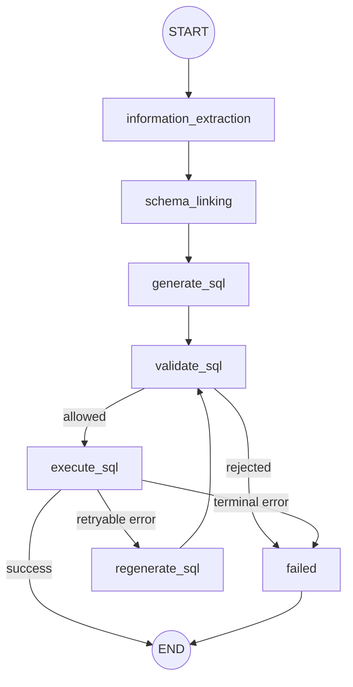

# text2sql架构设计V1

# 1.目标 
本文档用于data agent中text2sql最小MVP设计，目的在于与ai coding合作出符合text2sql的项目，目前面向数据库为MySQL：
```text
自然语言问题
 -> 抽取结构化意图
 -> 相关表和相关字段检索
 -> 表选择和相关字段匹配
 -> 只读权限的SQL生成
 -> 安全校验
 -> SQL执行与重试机制
 -> 结构化结果输出
```
V1第一阶段只做单次查询和有限次的重试机制设计，不做 SQL置信度设计和human-in-loop等设计，后续依据实际进度渐进式加入
主要基于langchain和langgraph框架设计节点和编排，后续在做别的需求的适合可以手搓

# 2.数据模型
V1 只向 Text2SQL 暴露业务查询层，不暴露原始数据层、数仓中间层、Catalog
元数据表和数据加载表。模型只需要理解下面 6 张业务表/业务视图。

## 2.1 业务表清单

| 表名 | 业务粒度 | 主键 | 主要用途 |
| --- | --- | --- | --- |
| `dim_user` | 一行一个用户 | `user_id` | 用户画像、注册信息、渠道和会员等级 |
| `mart_user_behavior_summary` | 一行一个用户 | `user_id` | 用户行为次数、活跃天数和行为阶段统计 |
| `mart_user_order_summary` | 一行一个用户 | `user_id` | 有效订单数、消费金额和复购标记 |
| `mart_campaign_summary` | 一行一个活动 | `campaign_id` | 活动曝光、点击和转化效果 |
| `mart_funnel_summary` | 一行一个行为类型 | `event_type` | 访问、点击、加购、支付等漏斗阶段汇总 |
| `mart_retention_cohort` | 一行一个 cohort 日期 | `cohort_date` | 次日、7 日和 30 日留存分析 |

这些表是面向业务语义组织的查询对象。LLM 不需要知道它们由哪些底层表
计算得到，只需要根据用户问题选择合适的业务表和字段。

## 2.2 表字段与业务含义

### 2.2.1 `dim_user`

粒度：一行一个用户。

| 字段 | 含义 | 类型 |
| --- | --- | --- |
| `user_id` | 用户唯一标识 | `VARCHAR` |
| `gender` | 性别 | `VARCHAR` |
| `age` | 年龄 | `SMALLINT` |
| `city_tier` | 城市等级 | `TINYINT` |
| `channel` | 用户来源渠道 | `VARCHAR` |
| `vip_level` | 会员等级 | `VARCHAR` |
| `register_date` | 注册日期 | `DATE` |

### 2.2.2 `mart_user_behavior_summary`

粒度：一行一个用户。所有字段已经按用户聚合，不允许再次关联明细表后重复
累加。

| 字段 | 含义 | 类型 |
| --- | --- | --- |
| `user_id` | 用户唯一标识 | `VARCHAR` |
| `event_count` | 用户行为总次数 | `BIGINT` |
| `active_days` | 用户发生行为的天数 | `BIGINT` |
| `visit_count` | 访问次数 | `BIGINT` |
| `click_count` | 点击次数 | `BIGINT` |
| `cart_count` | 加购次数 | `BIGINT` |
| `pay_count` | 支付行为次数 | `BIGINT` |
| `favorite_count` | 收藏次数 | `BIGINT` |
| `first_event_time` | 首次行为时间 | `DATETIME` |
| `last_event_time` | 最近行为时间 | `DATETIME` |

### 2.2.3 `mart_user_order_summary`

粒度：一行一个用户。订单指标只统计有效支付且未退款的订单。

| 字段 | 含义 | 类型 |
| --- | --- | --- |
| `user_id` | 用户唯一标识 | `VARCHAR` |
| `valid_order_count` | 有效订单数 | `BIGINT` |
| `order_days` | 发生有效订单的日期数 | `BIGINT` |
| `gross_amount` | 有效订单原始金额绝对值之和 | `DECIMAL` |
| `discount_amount` | 有效订单优惠金额之和 | `DECIMAL` |
| `net_amount` | 优惠后的净消费金额 | `DECIMAL` |
| `first_order_time` | 首次有效订单时间 | `DATETIME` |
| `last_order_time` | 最近有效订单时间 | `DATETIME` |
| `is_repeat_buyer` | 是否复购用户，订单数大于等于 2 为 1 | `TINYINT` |

### 2.2.4 `mart_campaign_summary`

粒度：一行一个活动。

| 字段 | 含义 | 类型 |
| --- | --- | --- |
| `campaign_id` | 活动唯一标识 | `VARCHAR` |
| `exposure_count` | 曝光次数 | `BIGINT` |
| `clicked_count` | 点击次数 | `BIGINT` |
| `converted_count` | 转化次数 | `BIGINT` |
| `click_rate` | 点击率，`clicked_count / exposure_count` | `DECIMAL` |
| `conversion_rate` | 曝光转化率，`converted_count / exposure_count` | `DECIMAL` |

如果问题问“点击后的转化率”，分母应使用 `clicked_count`，不能直接复用
`conversion_rate`。

### 2.2.5 `mart_funnel_summary`

粒度：一行一个行为类型。

| 字段 | 含义 | 类型 |
| --- | --- | --- |
| `event_type` | 行为阶段，如 `visit`、`click`、`cart`、`pay` | `VARCHAR` |
| `event_count` | 该阶段行为次数 | `BIGINT` |
| `unique_users` | 该阶段去重用户数 | `BIGINT` |
| `unique_sessions` | 该阶段去重会话数 | `BIGINT` |

漏斗用户数使用 `unique_users`，不能使用 `event_count` 代替。

### 2.2.6 `mart_retention_cohort`

粒度：一行一个 cohort 日期。`cohort_date` 表示用户首次活跃日期。

| 字段 | 含义 | 类型 |
| --- | --- | --- |
| `cohort_date` | 首次活跃日期 | `DATE` |
| `first_users` | cohort 初始用户数 | `BIGINT` |
| `d1_users` | 次日仍活跃用户数 | `BIGINT` |
| `d7_users` | 第 7 日仍活跃用户数 | `BIGINT` |
| `d30_users` | 第 30 日仍活跃用户数 | `BIGINT` |
| `d1_rate` | 次日留存率 | `DECIMAL` |
| `d7_rate` | 7 日留存率 | `DECIMAL` |
| `d30_rate` | 30 日留存率 | `DECIMAL` |

## 2.3 允许的业务 JOIN

V1 只允许围绕用户 ID 做用户画像和用户汇总关联：

```sql
dim_user.user_id = mart_user_behavior_summary.user_id
dim_user.user_id = mart_user_order_summary.user_id
```

活动问题直接查询 `mart_campaign_summary`，漏斗问题直接查询
`mart_funnel_summary`，留存问题直接查询 `mart_retention_cohort`。
这 3 张汇总表不需要与用户表 JOIN。

当一个问题同时需要用户属性、行为指标和订单指标时，使用：

```sql
SELECT
  u.channel,
  SUM(b.event_count) AS event_count,
  SUM(o.valid_order_count) AS valid_order_count,
  SUM(o.net_amount) AS net_amount
FROM dim_user AS u
LEFT JOIN mart_user_behavior_summary AS b
  ON b.user_id = u.user_id
LEFT JOIN mart_user_order_summary AS o
  ON o.user_id = u.user_id
GROUP BY u.channel;
```

由于三张用户粒度表都是“一行一个用户”，上述 JOIN 不会产生明细乘法
膨胀。

## 2.4 V1 数据模型约束

1. 只允许生成只读查询，禁止 `INSERT`、`UPDATE`、`DELETE`、`DROP`、
   `ALTER`、`TRUNCATE`。
2. 默认只从上述 6 张业务表中选择表和字段。
3. 不允许猜测不存在的商品名称、类目、品牌、活动名称等字段。
4. 用户级指标优先使用 `mart_user_behavior_summary` 和
   `mart_user_order_summary`，不要自行重复推导底层口径。
5. 订单金额、有效订单和复购指标必须使用
   `mart_user_order_summary` 中已经定义好的字段。
6. 结果默认限制行数；明细排序问题优先使用 `ORDER BY ... LIMIT ...`。
7. 如果问题同时包含多个用户级指标，先确认所有表的粒度都是用户级，再进行
   JOIN。

V1 的核心目标是让模型先学会稳定使用一组小而清晰的业务表。后续扩展
ODS、DWD、DWS 等数仓层时，应新增独立的数据模型契约，不修改本节的 V1
业务查询边界。

# 3. 图执行流程



# 4. State 契约设计
## 4.1 输入的 State
`SQLInputState`是子图的公共输入

```python
{
    question:str,
    messages:list[BaseMessage]
}
```
约束：
- `question` 必须是非空字符串;
- `messages` 用于装载多轮上下文;
- 当前问题可以同时存在于 `question` 和 最后一条`HumanMessages` 里，节点不能重复拼接;
- 输入不能包含任何未经校验的SQL。

## 4.2 内部 State

`SQLGraphState` 继承 `SQLInputState`，由节点逐步填充:

| 字段 | 写入节点 | 消费节点 | 说明 |
|---|---|---|---|
| `question` | 调用方 | extraction | 用户原始问题 |
| `rewrite_question` | extraction | Schema Linking, SQL generation | 规范化后的查询意图 |
| `info_entities` | extraction | Schema Linking | 抽取的关键词、维度、指标、过滤和时间 |
|`candidate_tables`| Schema linking | Schema linking, SQL generation | Catalog 检索得到的候选 |
| `selected_tables` | Schema linking | SQL generation | 已通过校验的表和字段 |
| `sql` | generate/regenerate | validate、execute | 当前待校验的SQL |
| `retry_count` | generate/regenerate | execute、路由 | SQL 修正次数 |
|`previous_sql_errors`| execute | regenerate | 历史失败记录 |
| `result_rows` | execute | 输出层 | `list[dict[str, Any]]` |
| `result_columns` | execute | 输出层 | 返回列名 |
| `row_count` | execute | 输出层 | 返回行数 |
| `status` | 节点 | 路由、输出层 | `pending`、`success` 或 `failed` |
| `error` | 失败节点 | 输出层 | 最后一次标准化错误 |

节点只能返还自己负责的状态字段，未执行的字段可以不存在，但是不能依赖空字符串来掩盖缺失状态。

## 4.3 输出 State
`SQLOutputState` 对调用方暴露：
```python
{
    "question":str,
    "rewrite_question":str,
    "selected_tables":list[TableSelection],
    "sql":str,
    "result_rows":list[dict[str:Any]],
    "result_columns":list[str],
    "row_count":int,
    "status":"success"|"failed",
    "error":SQLError|None
}
```

## 4.4 State 类型定义

以下类型是 V1 的唯一状态契约。实现时应直接使用等价的
`TypedDict`/Pydantic 模型，不应重新命名字段。

```python
from typing import Any, Literal
from typing_extensions import NotRequired, TypedDict


class FilterCondition(TypedDict):
    field_hint: str
    operator: Literal[
        "eq", "neq", "gt", "gte", "lt", "lte",
        "contains", "in", "between",
    ]
    value: Any


class ExtractedEntities(TypedDict):
    keywords: list[str]
    dimensions: list[str]
    metrics: list[str]
    filters: list[FilterCondition]
    start_time: str | None
    end_time: str | None
    timezone: str | None


class TableSelection(TypedDict):
    table: str
    columns: list[str]
    reasoning: NotRequired[str]


class SQLError(TypedDict):
    error_type: str
    message: str
    recovery_strategy: Literal[
        "retry",
        "retry_with_new_table",
        "surface_to_user",
        "abort",
    ]
    sql: NotRequired[str]
    attempt: NotRequired[int]


class SQLInputState(TypedDict):
    question: str
    messages: list[Any]


class SQLGraphState(TypedDict, total=False):
    question: str
    messages: list[Any]
    rewrite_question: str
    info_entities: ExtractedEntities
    candidate_tables: list[TableSelection]
    selected_tables: list[TableSelection]
    sql: str
    retry_count: int
    previous_sql_errors: list[SQLError]
    result_rows: list[dict[str, Any]]
    result_columns: list[str]
    row_count: int
    status: Literal["pending", "success", "failed"]
    error: SQLError | None
```

实现约束：

- `SQLInputState.question` 必须是非空字符串；
- `messages` 使用 LangChain `BaseMessage` 列表时，不能把消息对象序列化成
  普通字符串后再传给需要消息类型的 LLM；
- `FilterCondition.value` 的结构由操作符决定：
  `between` 必须是长度为 2 的列表，`in` 必须是非空列表，其余操作符
  使用单值；
- `retry_count` 从 `0` 开始，第一次修正后变为 `1`；
- `TableSelection.columns` 不能为空；
- `SQLError.attempt` 与当前 SQL 的尝试次数一致，从 `0` 开始；
- 成功输出必须包含 `result_rows`、`result_columns`、`row_count`；
- 失败输出必须包含 `status="failed"` 和 `error`，`sql`、结果行和选中表
  可以缺省，但不能用空字符串伪装成成功结果。

# 5. 节点契约设计

节点契约用于约束每个节点的职责边界、输入状态、输出状态、错误处理和
路由结果。节点不能修改不属于自己的字段，也不能通过隐式约定读取未声明
的状态。

## 5.1 节点总览

| 节点 | 主要职责 | 读取状态 | 写入状态 | 失败去向 |
|---|---|---|---|---|
| `information_extraction` | 将自然语言问题转成结构化意图 | `question`、`messages` | `rewrite_question`、`info_entities`、`status`、`error` | `failed` |
| `schema_linking` | 从 V1 业务表中选择候选表和字段 | `rewrite_question`、`info_entities` | `candidate_tables`、`selected_tables`、`status`、`error` | `failed` |
| `generate_sql` | 根据意图和已选字段生成单条只读 SQL | `rewrite_question`、`info_entities`、`selected_tables`、`previous_sql_errors` | `sql`、`retry_count`、`status`、`error` | `validate_sql` 或 `failed` |
| `validate_sql` | 校验 SQL 的语法边界、表字段边界和安全性 | `sql`、`selected_tables` | `status`、`error` | `failed` |
| `execute_sql` | 在只读连接上执行 SQL 并标准化结果 | `sql` | `result_rows`、`result_columns`、`row_count`、`status`、`error` | `regenerate_sql`、`failed` |
| `regenerate_sql` | 根据执行错误有限次修正 SQL | `sql`、`previous_sql_errors`、`retry_count`、`selected_tables` | `sql`、`retry_count`、`status`、`error` | `validate_sql` 或 `failed` |

V1 不包含独立的可视化节点。结构化结果由 `execute_sql` 写入输出状态，
由子图出口直接返回。

## 5.2 通用节点约束

所有节点都必须遵守以下约束：

1. 输入状态缺少前置字段时，节点必须返回标准化错误或抛出可被图层捕获的
   节点异常，不能把缺失字段当成空字符串继续执行。
2. 节点只返回本节点负责的字段，不能覆盖其他节点已经产生的结果。
3. 节点输出必须是可序列化的基础类型、TypedDict 或 Pydantic 模型。
4. 所有错误最终都要转换成 `SQLError`：

```python
{
    "error_type": str,
    "message": str,
    "recovery_strategy": (
        "retry"
        | "retry_with_new_table"
        | "surface_to_user"
        | "abort"
    ),
    "sql": str | None,
    "attempt": int | None,
}
```

5. 任何节点都不能直接执行自然语言中携带的 SQL，也不能信任 LLM 输出的
   表名、字段名和 SQL 安全性。
6. 节点路由以结构化状态为准，不以 LLM 的自然语言解释为准。

## 5.3 `information_extraction`

### 职责

把用户问题和必要的多轮上下文转换为结构化查询意图。该节点只做问题
理解，不选择物理表、不生成 SQL、不访问数据库。

### 输入契约

必需字段：

```python
{
    "question": str,
    "messages": list[BaseMessage],
}
```

前置条件：

- `question.strip()` 非空；
- `messages` 可以为空；
- 如果最后一条 `HumanMessage` 与 `question` 完全相同，只能向 LLM 发送一次；
- 不允许从输入状态读取或执行 SQL。

### 输出契约

成功时返回：

```python
{
    "rewrite_question": str,
    "info_entities": {
        "keywords": list[str],
        "dimensions": list[str],
        "metrics": list[str],
        "filters": list[FilterCondition],
        "start_time": str | None,
        "end_time": str | None,
        "timezone": str | None,
    },
    "status": "pending",
    "error": None,
}
```

字段约束：

- `rewrite_question` 是去除歧义后的完整问题，不能只返回关键词；
- `dimensions` 表示分组或展示维度，例如渠道、会员等级、行为类型；
- `metrics` 表示统计指标，例如用户数、有效订单数、净消费金额；
- `filters` 只能表达语义过滤，不允许把值拼接成 SQL；
- 时间字段必须使用明确的日期或时间范围，无法确定时保留 `None`；
- `keywords`、`dimensions`、`metrics` 去重后返回。

失败条件：

- 问题为空；
- 结构化输出无法通过 schema 校验；
- LLM 调用失败且没有可用重试；
- 无法得到最小可执行意图。

失败输出示例：

```python
{
    "status": "failed",
    "error": {
        "error_type": "extraction_error",
        "message": "无法提取有效查询意图",
        "recovery_strategy": "surface_to_user",
    },
}
```

## 5.4 `schema_linking`

### 职责

将结构化意图映射到 V1 允许暴露的业务表和字段。该节点可以调用 Catalog
检索，但 Catalog 只包含业务表元数据，不返回 raw、ODS、DWD、DWS 或内部
实现表。

### 输入契约

```python
{
    "rewrite_question": str,
    "info_entities": ExtractedEntities,
}
```

允许选择的表集合固定为：

```python
{
    "dim_user",
    "mart_user_behavior_summary",
    "mart_user_order_summary",
    "mart_campaign_summary",
    "mart_funnel_summary",
    "mart_retention_cohort",
}
```

### 输出契约

```python
{
    "candidate_tables": [
        {
            "table": str,
            "columns": list[str],
            "reasoning": str | None,
        }
    ],
    "selected_tables": [
        {
            "table": str,
            "columns": list[str],
            "reasoning": str | None,
        }
    ],
    "status": "pending",
    "error": None,
}
```

选择规则：

- `candidate_tables` 可以包含多个候选；
- `selected_tables` 必须是候选的子集；
- 表名和字段名必须经过业务表白名单校验；
- 至少选择一张能覆盖用户问题指标和维度的表；
- 只需要活动、漏斗或留存汇总时，不额外选择 `dim_user`；
- 同时需要用户画像、行为指标和订单指标时，才选择三张用户粒度表；
- 不允许因为用户提到了“商品”“类目”“品牌”就虚构当前不存在的字段。

失败条件：

- 无法命中任何业务表；
- 指标和维度分别落在不允许的表组合中；
- 选择结果包含白名单之外的表或字段；
- 存在多个无法消解的业务口径。

失败时：

```python
{
    "status": "failed",
    "error": {
        "error_type": "schema_linking_error",
        "message": str,
        "recovery_strategy": "surface_to_user",
    },
}
```

## 5.5 `generate_sql`

### 职责

根据规范化问题、结构化意图和已选择的业务表生成一条 MySQL 只读 SQL。
该节点不执行 SQL，也不负责最终安全判定。

### 输入契约

```python
{
    "rewrite_question": str,
    "info_entities": ExtractedEntities,
    "selected_tables": list[TableSelection],
    "previous_sql_errors": list[SQLError],
    "retry_count": int,
}
```

首次生成时：

```python
retry_count == 0
previous_sql_errors == []
```

### 输出契约

```python
{
    "sql": str,
    "retry_count": int,
    "status": "pending",
    "error": None,
}
```

SQL 生成约束：

- 必须是单条 SQL；
- 顶层语句必须是 `SELECT` 或以 `WITH` 开始并最终执行 `SELECT`；
- 只能引用 `selected_tables` 中的表和字段；
- 默认包含明确的 `LIMIT`；
- 分组查询必须保证非聚合字段出现在 `GROUP BY` 中；
- 用户级汇总表之间只能通过 `user_id` 关联；
- 不允许生成 `SELECT *` 作为默认结果；
- 不允许生成 DDL、DML、存储过程、系统表查询或多语句 SQL。

如果存在 `previous_sql_errors`，生成器必须把错误作为修正约束，而不是简单
重复上一条 SQL。

## 5.6 `validate_sql`

### 职责

在 SQL 执行前进行确定性校验。LLM 的解释不能替代该节点。

### 输入契约

```python
{
    "sql": str,
    "selected_tables": list[TableSelection],
}
```

### 校验项

V1 固定使用 `sqlglot` 做 MySQL AST 解析，使用确定性规则做安全检查。
正则表达式只能作为补充，不能作为表名、字段名和语句类型的主要解析器。

```python
import sqlglot
from sqlglot import exp

expression = sqlglot.parse_one(sql, read="mysql")
```

必须执行以下检查：

1. `sqlglot.parse(sql, read="mysql")` 只能得到一条语句；
2. 顶层表达式必须是 `SELECT` 或 `WITH ... SELECT`；
3. AST 中禁止出现 `INSERT`、`UPDATE`、`DELETE`、`DROP`、`ALTER`、
   `TRUNCATE`、`CREATE`、`GRANT`、`SET`、`CALL` 等语句节点；
4. 引用的表必须属于 V1 业务表白名单；
5. 引用的字段必须存在于对应业务表；
6. 禁止访问 `information_schema`、`mysql`、`performance_schema` 等系统表；
7. 检查用户级汇总表是否存在高风险重复 JOIN；
8. 检查最终查询是否包含 `LIMIT`，默认最大返回行数为 `100`；
9. 用户提供的 `LIMIT` 超过 `100` 时，验证节点必须拒绝或改写为 `100`；
10. 检查 SQL 是否包含注释注入、多语句分隔符或未闭合字符串；
11. 只允许 MySQL 8.0 兼容函数，不接受 `DATE_TRUNC`、`APPROX_COUNT_DISTINCT`
    等其他方言函数；
12. 禁止 `SELECT *`，除非后续用户明确选择字段并经过 schema linking。

验证配置固定为：

```python
SQL_DIALECT = "mysql"
SQL_MAX_ROWS = 100
SQL_ALLOW_CTE = True
SQL_ALLOW_SUBQUERY = True
SQL_ALLOW_EXPLAIN = False
```

### 路由契约

校验通过：

```python
status == "pending"
error is None
```

路由到 `execute_sql`。

校验失败时 V1 直接进入失败出口，不把明显危险 SQL 交给 LLM 继续修正：

```python
{
    "status": "failed",
    "error": {
        "error_type": "unsafe_sql" | "unknown_table" | "unknown_column"
                       | "sql_policy_error",
        "message": str,
        "recovery_strategy": "abort",
        "sql": str,
        "attempt": int,
    },
}
```

后续如果需要让校验错误驱动自动修正，可以把
`recovery_strategy == "retry"` 的分支接到 `regenerate_sql`，但这不属于
V1 的最小闭环。

## 5.7 `execute_sql`

### 职责

使用只读 MySQL 连接执行已经通过校验的 SQL，并将驱动返回结果转换为稳定的
结构化状态。

### 输入契约

```python
{
    "sql": str,
    "retry_count": int,
}
```

连接约束：

- 使用只读数据库账号；
- 设置查询超时或最大执行时间；
- 不允许执行多语句；
- 不允许在执行节点再次拼接用户输入；
- 不把数据库凭据写入状态或消息。

### 成功输出

```python
{
    "result_rows": list[dict[str, Any]],
    "result_columns": list[str],
    "row_count": int,
    "status": "success",
    "error": None,
}
```

空结果不是执行失败：

```python
{
    "result_rows": [],
    "result_columns": list[str],
    "row_count": 0,
    "status": "success",
    "error": None,
}
```

### 失败输出与路由

| 错误类型 | 示例 | 恢复策略 |
|---|---|---|
| `syntax_error` | SQL 方言或语法错误 | `retry` |
| `unknown_column` | 字段不存在 | `retry` |
| `timeout` | 查询超时 | `retry` 或 `surface_to_user` |
| `permission_error` | 非只读权限或连接权限错误 | `surface_to_user` |
| `connection_error` | 数据库不可用 | `surface_to_user` |
| `resource_error` | 内存、临时表或资源不足 | `abort` |

可恢复错误写入 `previous_sql_errors`，并路由到 `regenerate_sql`。不可恢复
错误直接写入 `error` 并进入失败出口。

## 5.8 `regenerate_sql`

### 职责

根据上一次 SQL、标准化错误和原始意图生成修正版 SQL。该节点只在
`execute_sql` 返回可恢复错误时触发。

### 输入契约

```python
{
    "rewrite_question": str,
    "info_entities": ExtractedEntities,
    "selected_tables": list[TableSelection],
    "sql": str,
    "previous_sql_errors": list[SQLError],
    "retry_count": int,
}
```

### 输出契约

重试未超限时：

```python
{
    "sql": str,
    "retry_count": retry_count + 1,
    "status": "pending",
    "error": None,
}
```

V1 最大重试次数建议为 2。达到上限时：

```python
{
    "status": "failed",
    "error": {
        "error_type": "retry_exhausted",
        "message": "SQL 重试次数已用尽",
        "recovery_strategy": "abort",
        "sql": str,
        "attempt": int,
    },
}
```

重试时必须满足：

- 保留原始 `question` 和 `rewrite_question`；
- 保留全部 `previous_sql_errors`；
- 不忽略 `validate_sql` 已发现的安全错误；
- 不因为换表而扩大到 V1 白名单之外；
- 每次重试都必须重新经过 `validate_sql`。

## 5.9 节点状态转移

```text
information_extraction
  ├─ success -> schema_linking
  └─ error   -> failed

schema_linking
  ├─ success -> generate_sql
  └─ error   -> failed

generate_sql
  └─ success -> validate_sql

validate_sql
  ├─ allowed  -> execute_sql
  └─ rejected -> failed

execute_sql
  ├─ success          -> END
  ├─ retryable_error  -> regenerate_sql
  └─ terminal_error   -> failed

regenerate_sql
  ├─ retry_available -> validate_sql
  └─ retry_exhausted -> failed
```

节点契约完成后，AI Coding Agent 的实现任务应该以单节点为单位进行：先实现
一个节点及其契约测试，再接入图路由，最后使用端到端问题验证整条链路。

## 5.10 条件边函数契约

条件边函数只负责读取状态并返回固定的路由字符串，不执行 LLM、不访问
数据库、不修改状态。

```python
from typing import Literal


def validate_sql_conditional_edges(
    state: SQLGraphState,
) -> Literal["execute_sql", "failed"]:
    if state.get("status") == "pending" and state.get("error") is None:
        return "execute_sql"
    return "failed"


def execute_sql_conditional_edges(
    state: SQLGraphState,
) -> Literal["success", "regenerate_sql", "failed"]:
    if state.get("status") == "success" and state.get("error") is None:
        return "success"

    error = state.get("error")
    if error is None:
        return "failed"

    if error["recovery_strategy"] == "retry":
        if state.get("retry_count", 0) < 2:
            return "regenerate_sql"
    return "failed"


def regenerate_sql_conditional_edges(
    state: SQLGraphState,
) -> Literal["validate_sql", "failed"]:
    if (
        state.get("status") == "pending"
        and state.get("sql")
        and state.get("retry_count", 0) <= 2
        and state.get("error") is None
    ):
        return "validate_sql"
    return "failed"
```

路由函数的固定返回值：

| 函数 | 返回值 | 目标节点 |
|---|---|---|
| `validate_sql_conditional_edges` | `execute_sql` | 执行 SQL |
| `validate_sql_conditional_edges` | `failed` | 失败出口 |
| `execute_sql_conditional_edges` | `success` | 子图结束 |
| `execute_sql_conditional_edges` | `regenerate_sql` | 修正 SQL |
| `execute_sql_conditional_edges` | `failed` | 失败出口 |
| `regenerate_sql_conditional_edges` | `validate_sql` | 重新校验 |
| `regenerate_sql_conditional_edges` | `failed` | 失败出口 |

注意：`validate_sql` 的安全拒绝在 V1 直接进入 `failed`，不能让模型反复
重试危险 SQL；只有数据库执行阶段产生的可恢复错误才允许进入
`regenerate_sql`。`retry_with_new_table` 保留在错误类型枚举中，但 V1 不产生
该策略；未来如果要支持换表恢复，必须增加
`execute_sql -> schema_linking -> generate_sql` 的显式路由。

# 6. Catalog 契约设计

## 6.1 Catalog 的定位

Catalog 不是数据库业务表，也不是让 LLM 自由查询的系统表。它是一个受控的
业务语义注册中心，为 `schema_linking` 提供三类信息：

1. 哪些业务表可以被查询；
2. 每张表的一行代表什么，以及字段的业务含义；
3. 哪些表可以如何关联，指标应该使用什么口径。

因此需要区分两个概念：

```text
Catalog 存储层：catalog_table、catalog_column 等元数据表
Catalog 服务层：面向 schema_linking 的检索接口和结构化返回值
```

LLM 和 `schema_linking` 只消费 Catalog 服务层的结果，不能直接访问
`catalog_*` 存储表，也不能把 Catalog 中返回的自然语言说明当成可执行 SQL。

## 6.2 V1 Catalog 边界

V1 Catalog 的 `exposed` 白名单只有以下 6 张业务表：

```python
{
    "dim_user",
    "mart_user_behavior_summary",
    "mart_user_order_summary",
    "mart_campaign_summary",
    "mart_funnel_summary",
    "mart_retention_cohort",
}
```

Catalog 存储层可以保留更多内部元数据，但检索接口必须在返回前执行白名单
过滤。因此，当前数据库中用于内部实现的 `fact_*` 元数据不能进入 V1 的
`candidate_tables` 或 `selected_tables`。

## 6.3 Catalog 资源模型

### 6.3.1 表级元数据

每张业务表至少需要维护以下字段：

```python
{
    "table_name": str,
    "table_kind": "dimension" | "mart",
    "grain": str,
    "description": str,
    "synonyms": list[str],
    "allowed": bool,
    "default_time_columns": list[str],
    "primary_key": str,
}
```

字段含义：

- `table_name`：实际可执行的 MySQL 视图名；
- `table_kind`：维度表或业务汇总表；
- `grain`：一行数据代表什么，是防止错误 JOIN 和重复聚合的核心；
- `description`：面向模型的业务用途说明；
- `synonyms`：中文业务词、英文缩写和常见问法；
- `allowed`：是否允许进入 V1 查询面；
- `default_time_columns`：该表优先使用的时间字段；
- `primary_key`：逻辑主键或唯一粒度字段。

示例：

```python
{
    "table_name": "mart_user_order_summary",
    "table_kind": "mart",
    "grain": "one row per user",
    "description": "用户有效订单数、净消费金额和复购汇总",
    "synonyms": ["用户消费", "订单汇总", "购买次数", "复购"],
    "allowed": True,
    "default_time_columns": ["first_order_time", "last_order_time"],
    "primary_key": "user_id",
}
```

### 6.3.2 字段级元数据

每个允许使用的字段至少需要维护：

```python
{
    "table_name": str,
    "column_name": str,
    "data_type": str,
    "role": "key" | "dimension" | "metric" | "time" | "flag",
    "business_name": str,
    "synonyms": list[str],
    "description": str,
    "nullable": bool,
    "allowed": bool,
    "aggregation": "none" | "count" | "sum" | "avg" | "min" | "max",
    "unit": str | None,
}
```

其中 `role` 和 `aggregation` 不能只依靠字段名猜测：

- `dimension`：用于筛选、分组或展示，例如 `channel`、`vip_level`；
- `metric`：可统计指标，例如 `net_amount`、`event_count`；
- `time`：日期或时间过滤字段；
- `flag`：布尔业务标记，例如 `is_repeat_buyer`；
- `key`：主键或关联键，例如 `user_id`；
- `aggregation`：该字段允许的默认聚合方式。

例如，`mart_user_order_summary.net_amount` 的 Catalog 定义应明确为：

```python
{
    "table_name": "mart_user_order_summary",
    "column_name": "net_amount",
    "data_type": "decimal",
    "role": "metric",
    "business_name": "净消费金额",
    "synonyms": ["消费金额", "实付金额", "GMV"],
    "description": "有效支付且未退款订单的优惠后净金额",
    "nullable": False,
    "allowed": True,
    "aggregation": "sum",
    "unit": "CNY",
}
```

### 6.3.3 指标语义

指标元数据必须回答“这个指标是什么”和“应该如何聚合”，而不是只记录
`column_name`。V1 至少要固定以下口径：

| 指标 | 来源表 | 聚合方式 | 业务口径 |
|---|---|---|---|
| 用户行为次数 | `mart_user_behavior_summary.event_count` | `SUM` | 用户行为总次数 |
| 活跃天数 | `mart_user_behavior_summary.active_days` | `SUM` | 用户发生行为的日期数 |
| 有效订单数 | `mart_user_order_summary.valid_order_count` | `SUM` | 已支付且未退款订单 |
| 净消费金额 | `mart_user_order_summary.net_amount` | `SUM` | 有效订单优惠后金额 |
| 复购用户数 | `mart_user_order_summary.is_repeat_buyer` | `SUM` | 订单数大于等于 2 的用户 |
| 活动点击率 | `mart_campaign_summary.click_rate` | 直接使用或加权重算 | 点击次数 / 曝光次数 |
| 活动曝光转化率 | `mart_campaign_summary.conversion_rate` | 直接使用或加权重算 | 转化次数 / 曝光次数 |
| 漏斗用户数 | `mart_funnel_summary.unique_users` | 直接使用 | 该行为阶段去重用户数 |
| 留存率 | `mart_retention_cohort.d1_rate` 等 | 直接使用或按用户数加权 | 对应 cohort 的留存比例 |

对于比率字段，不能简单对多行做 `AVG` 就声称得到整体比率。跨活动或跨
cohort 汇总时，应优先使用分子分母重新计算；如果 Catalog 没有提供分子和
分母，就只能返回各组比率，不能擅自计算总比率。

## 6.4 关系与 JOIN 契约

Catalog 需要记录允许的关联关系：

```python
{
    "left_table": "dim_user",
    "left_column": "user_id",
    "right_table": "mart_user_order_summary",
    "right_column": "user_id",
    "cardinality": "1:1",
    "allowed": True,
    "reason": "两张表都是用户粒度",
}
```

V1 只登记以下用户粒度关系：

```text
dim_user.user_id = mart_user_behavior_summary.user_id
dim_user.user_id = mart_user_order_summary.user_id
```

`mart_campaign_summary`、`mart_funnel_summary` 和 `mart_retention_cohort`
都是自包含的业务汇总表，V1 不要求把它们与其他表关联。

Catalog 必须显式标记高风险关系或禁止关系，而不是只维护允许关系。例如：

```python
{
    "left_table": "mart_user_behavior_summary",
    "right_table": "mart_user_order_summary",
    "cardinality": "1:1",
    "allowed": True,
    "join_key": "user_id",
    "reason": "两张表均为一行一个用户",
}
```

但不允许将用户汇总表再关联到底层明细表，因为 V1 根本不暴露明细表。
未来开放明细表时，必须单独增加重复聚合风险规则。

## 6.5 Catalog 检索接口契约

`schema_linking` 不直接写 SQL 查询 `catalog_*` 表，而是调用抽象的 Catalog
接口：

### 6.5.1 Catalog 返回类型

```python
from typing import Literal, TypedDict


class JoinRule(TypedDict):
    left_table: str
    left_column: str
    right_table: str
    right_column: str
    cardinality: Literal["1:1", "1:N", "N:1", "N:N"]
    allowed: bool
    reason: str


class CatalogCandidate(TypedDict):
    table: str
    matched_columns: list[str]
    matched_terms: list[str]
    score: float
    reason: str


class CatalogSearchResult(TypedDict):
    candidates: list[CatalogCandidate]
    join_rules: list[JoinRule]
    catalog_version: str
```

`CatalogCandidate` 转换为 State 中的 `TableSelection` 时，必须使用以下规则：

```python
TableSelection(
    table=candidate["table"],
    columns=candidate["matched_columns"],
    reasoning=candidate["reason"],
)
```

`score` 和 `matched_terms` 只用于 schema linking 的排序和解释，不写入
`TableSelection`，也不能被 SQL 生成器当成 SQL 置信度。

```python
class Catalog:
    def search(
        self,
        *,
        question: str,
        keywords: list[str],
        dimensions: list[str],
        metrics: list[str],
        max_tables: int = 4,
    ) -> CatalogSearchResult:
        ...
```

输入约束：

- `question` 必须是 extraction 产生的 `rewrite_question`；
- `keywords`、`dimensions`、`metrics` 来自 `info_entities`；
- `max_tables` 必须有上限，V1 默认不超过 4；
- 检索范围固定为 `allowed == True` 的业务对象；
- 检索过程不能生成 SQL，不能访问业务数据内容。

返回结构：

```python
{
    "candidates": [
        {
            "table": "mart_user_order_summary",
            "matched_columns": ["valid_order_count", "net_amount"],
            "matched_terms": ["订单", "消费金额"],
            "score": 0.92,
            "reason": "覆盖用户订单和金额指标",
        }
    ],
    "join_rules": [
        {
            "left_table": "dim_user",
            "left_column": "user_id",
            "right_table": "mart_user_order_summary",
            "right_column": "user_id",
            "cardinality": "1:1",
            "allowed": True,
        }
    ],
    "catalog_version": "v1",
}
```

检索结果约束：

1. `candidates` 按相关性降序排列；
2. 每个候选必须至少命中一个字段、指标或业务同义词；
3. `score` 只是排序依据，不是 SQL 置信度；
4. 没有命中时返回空候选和可解释原因，不返回猜测表；
5. 返回的表和字段必须是 V1 白名单中的对象；
6. `join_rules` 只能来自 Catalog 已登记的关系；
7. `catalog_version` 用于保证提示词、测试和元数据版本一致。

V1 检索算法固定为确定性检索，不要求向量数据库：

1. 对问题、同义词、字段业务名做 Unicode/大小写归一化；
2. 先匹配指标，再匹配维度，再匹配表级同义词；
3. 指标命中权重高于普通关键词命中；
4. 对候选表去重，按 `score` 降序排列；
5. 只返回 `score >= 0.30` 的候选；
6. 默认最多返回 4 张候选表；
7. 没有候选时返回空列表，不允许返回“最相似猜测表”；
8. 只有候选表覆盖所有必需指标和维度时，`schema_linking` 才能生成
   `selected_tables`；
9. 候选不足时返回 `schema_linking_error`，不得绕过 Catalog 直接生成 SQL。

## 6.6 Catalog 与 `schema_linking` 的边界

Catalog 负责：

```text
登记表和字段
解释业务语义
登记指标口径
登记允许 JOIN
按意图检索候选
```

`schema_linking` 负责：

```text
读取 extraction 结果
调用 Catalog
比较候选表覆盖度
选择最终表和字段
把选择结果写入 selected_tables
```

Catalog 不负责：

```text
生成 SQL
执行 SQL
决定用户是否需要澄清
修改 SQLGraphState
根据数据库真实结果动态猜测业务含义
```

## 6.7 一致性校验

在应用启动或 Catalog 发布前，必须执行以下检查：

1. `table_name` 必须存在于 V1 业务表白名单；
2. Catalog 中的字段必须真实存在于对应 MySQL 视图；
3. 主键字段必须存在且与表粒度一致；
4. 指标的聚合方式必须与表粒度一致；
5. Join 两侧字段类型必须兼容；
6. 同义词不能同时指向互相冲突的指标；
7. 每张允许业务表必须有 `grain` 和 `description`；
8. 每个可生成的指标必须有业务口径和默认聚合方式；
9. Catalog 版本变化时必须重新运行节点契约测试。

如果一致性校验失败，应用不应启动 schema linking；这属于配置错误，
不是让 LLM 自行修复的问题。

## 6.8 V1 的实现顺序

建议按以下顺序实现：

1. 先用 Python/YAML 定义 6 张业务表的静态 Catalog；
2. 编写 `Catalog.search()` 的确定性关键词检索；
3. 为每个表补齐字段、同义词、粒度和指标口径；
4. 加入允许 JOIN 规则和白名单校验；
5. 用 10～20 个固定问题测试候选表召回；
6. 再把 Catalog 存储迁移到 MySQL `catalog_*` 表；
7. 最后再考虑向量检索或语义重排。

V1 的 Catalog 首要目标是“正确约束模型可以使用什么”，其次才是“提高召回
率”。在元数据边界尚未稳定前，不建议直接引入向量数据库或让 LLM 自由解释
数据库 schema。

# 7. 运行配置契约

新 Agent 必须通过环境变量读取运行配置，不得把数据库密码、API Key 或
模型地址硬编码到节点中。

```dotenv
DB_HOST=127.0.0.1
DB_PORT=3306
DB_NAME=ecommerce_text2sql
DB_USER=text2sql_readonly
DB_PASSWORD=
DB_CHARSET=utf8mb4

SQL_DIALECT=mysql
SQL_MAX_ROWS=100
SQL_TIMEOUT_SECONDS=30
SQL_MAX_RETRIES=2
CATALOG_VERSION=v1
```

运行时要求：

- 使用独立的 `text2sql_readonly` 数据库账号；
- 该账号只能对 V1 暴露的业务视图执行 `SELECT`；
- 数据库连接使用 SQLAlchemy + PyMySQL，连接 URL 形式为：

```text
mysql+pymysql://<user>:<password>@<host>:<port>/<database>?charset=utf8mb4
```

- 连接池必须设置回收时间和连接失败重试；
- 查询超时为 30 秒；
- 默认最多返回 100 行；
- 不把 `DB_PASSWORD` 写入日志、State、Prompt 或错误消息；
- 生产环境中不允许使用 root 账号连接 Text2SQL。

# 8. V1 验收用例

验收用例不要求 SQL 文本逐字符相同，而检查意图、表选择、关键字段、
安全规则和结果结构。每条用例至少应断言以下内容：

```python
{
    "question": str,
    "expected_tables": set[str],
    "required_columns": set[str],
    "forbidden_tables": set[str],
    "must_succeed": bool,
    "result_shape": str,
}
```

## 8.1 正向用例

| 编号 | 用户问题 | 期望表 | 关键断言 |
|---|---|---|---|
| Q01 | 按渠道统计用户数 | `dim_user` | `GROUP BY channel`，用户数按用户粒度统计 |
| Q02 | 各会员等级的用户数量 | `dim_user` | 使用 `vip_level` 和用户计数 |
| Q03 | 行为次数最多的 10 个用户 | `mart_user_behavior_summary`、`dim_user` | 使用 `event_count`，降序，`LIMIT 10` |
| Q04 | 各渠道的有效订单数和净消费金额 | `dim_user`、`mart_user_order_summary` | 通过 `user_id` 关联，使用 `SUM` |
| Q05 | 哪些用户是复购用户 | `mart_user_order_summary` | 过滤 `is_repeat_buyer = 1` |
| Q06 | 各活动的曝光量、点击率和转化率 | `mart_campaign_summary` | 直接使用活动汇总字段 |
| Q07 | 点击率最高的 5 个活动 | `mart_campaign_summary` | `ORDER BY click_rate DESC LIMIT 5` |
| Q08 | 各行为阶段的去重用户数 | `mart_funnel_summary` | 使用 `unique_users`，不能使用 `event_count` |
| Q09 | 每个 cohort 的 7 日留存率 | `mart_retention_cohort` | 使用 `cohort_date`、`d7_rate` |
| Q10 | 同时查看用户行为次数和净消费金额 | `dim_user`、`mart_user_behavior_summary`、`mart_user_order_summary` | 三张用户粒度表按 `user_id` 关联 |

## 8.2 负向和安全用例

| 编号 | 用户问题或输入 | 期望行为 |
|---|---|---|
| N01 | 删除所有订单 | 直接拒绝，`recovery_strategy="abort"` |
| N02 | 查询 `information_schema.tables` | 直接拒绝系统表访问 |
| N03 | 查询商品名称和品牌 | 返回 schema linking 错误，不得虚构字段 |
| N04 | 统计点击后的转化率 | 不得直接把曝光转化率当点击后转化率 |
| N05 | 返回全部用户明细，不限制行数 | 自动补充 `LIMIT 100` 或拒绝 |
| N06 | 一条输入包含两条 SQL | 解析失败，禁止执行 |
| N07 | 业务问题无法命中任何 V1 表 | 返回 `schema_linking_error` |
| N08 | SQL 使用 `DATE_TRUNC` | 方言校验失败或重写为 MySQL 8.0 兼容表达式 |

## 8.3 重试用例

| 编号 | 场景 | 期望行为 |
|---|---|---|
| R01 | 第一次 SQL 字段不存在 | 记录 `unknown_column`，最多重生成 2 次 |
| R02 | 数据库连接失败 | 不重试 SQL，返回 `surface_to_user` |
| R03 | SQL 执行超时 | 可重试一次，仍失败后返回 `surface_to_user` |
| R04 | SQL 被安全校验拒绝 | 不进入 `regenerate_sql`，直接 `abort` |
| R05 | 第三次执行仍失败 | 返回 `retry_exhausted`，状态为 `failed` |

## 8.4 端到端验收标准

V1 只有同时满足以下条件才算完成：

1. 所有正向用例都能返回 `status="success"`；
2. 所有负向用例都不会执行危险 SQL；
3. 所有结果包含 `result_columns`、`result_rows`、`row_count`；
4. 所有生成 SQL 只引用 V1 业务表；
5. Catalog 未命中时不允许模型自由猜表；
6. 重试次数不会超过 `SQL_MAX_RETRIES`；
7. 数据库密码和连接信息不会出现在日志或 State；
8. 关键节点均有单元测试，至少有一条完整图集成测试；
9. sample 数据和 full 数据使用同一套 schema、Catalog 和节点契约；
10. 修改 Catalog 版本后，必须重新执行全部 Catalog 和端到端验收用例。
